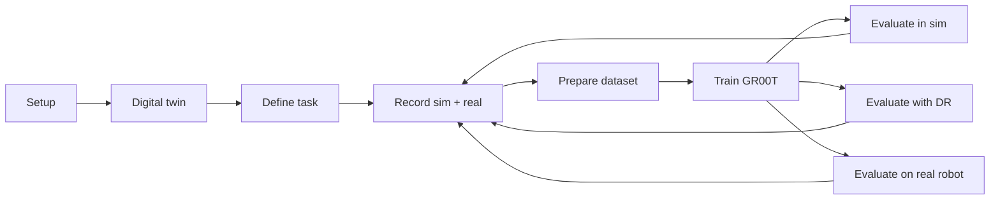

# SO-101 sim-to-real: Isaac Lab, LeRobot and GR00T

This fork of the [NVIDIA SO-101 workshop](https://github.com/isaac-sim/Sim-to-Real-SO-101-Workshop)
extends the original vial-to-rack workflow with a photo-matched **MyRoom** digital
twin and a cube pick-and-place task. Use Isaac Lab for simulation, LeRobot for
teleoperation and datasets, and GR00T for training and policy serving.

Follow the [NVIDIA course](https://docs.nvidia.com/learning/physical-ai/sim-to-real-so-101/latest/index.html)
for the original workshop. This guide documents the code in this fork, including
its current limitations. Measure your own scene; the packaged geometry and
calibration belong to one setup.



## Quick start: record one simulation episode

1. On a fresh **host**, first install the GPU driver, Docker, NVIDIA Container
   Toolkit and X11 prerequisites in [Setup](docs/01-setup.md). Connect an SO-101
   leader. A physical follower is optional for this first simulation recording.
   Clone and build on the **host**:

```bash
mkdir -p ~/sim2real
cd ~/sim2real
git clone https://github.com/iampa1teja/Sim-To-Real.git
cd Sim-To-Real
mkdir -p outputs datasets
touch docker/env
docker build -t teleop-docker -f docker/sim/Dockerfile .
```

2. Run on the **host**, from the repository root. This retains the workshop's
   X11 and volume setup; it opens X access broadly, so use a trusted local
   workstation. See [Setup](docs/01-setup.md) for persistence and extra shells.

```bash
xhost +
docker run --name teleop -it --privileged --gpus all -e "ACCEPT_EULA=Y" --rm --network=host \
  -e "PRIVACY_CONSENT=Y" -e DISPLAY \
  -v /dev:/dev -v /run/udev:/run/udev:ro \
  -v "$HOME/.Xauthority:/root/.Xauthority" \
  -v ~/docker/isaac-sim/cache/kit:/isaac-sim/kit/cache:rw \
  -v ~/docker/isaac-sim/cache/ov:/root/.cache/ov:rw \
  -v ~/docker/isaac-sim/cache/pip:/root/.cache/pip:rw \
  -v ~/docker/isaac-sim/cache/glcache:/root/.cache/nvidia/GLCache:rw \
  -v ~/docker/isaac-sim/cache/computecache:/root/.nv/ComputeCache:rw \
  -v ~/docker/isaac-sim/logs:/root/.nvidia-omniverse/logs:rw \
  -v ~/docker/isaac-sim/data:/root/.local/share/ov/data:rw \
  -v ~/docker/isaac-sim/documents:/root/Documents:rw \
  -v ~/.cache/huggingface/lerobot/calibration:/root/.cache/huggingface/lerobot/calibration \
  -v "$(pwd)/docker/env:/root/env" \
  -v "$(pwd)/source:/workspace/Sim-to-Real-SO-101-Workshop/source" \
  -v "$(pwd)/outputs:/workspace/Sim-to-Real-SO-101-Workshop/outputs" \
  -v "$(pwd)/datasets:/workspace/Sim-to-Real-SO-101-Workshop/datasets" \
  -v "$(pwd)/docker/real/scripts:/workspace/Sim-to-Real-SO-101-Workshop/docker/real/scripts" \
  teleop-docker:latest
```

3. In the **teleop container**, run discovery first:

```bash
lerobot-find-port
lerobot-find-cameras opencv
```

4. In the **teleop container**, replace the port placeholder with the discovered
   leader device and follow calibration prompts. Keep the workspace clear during
   calibration. Then record (the dataset triple enables writing):

```bash
setenv TELEOP_PORT '/dev/serial/by-id/<leader-device>'
setenv TELEOP_ID leader_arm_1
lerobot-calibrate --teleop.type=so101_leader --teleop.port="$TELEOP_PORT" --teleop.id="$TELEOP_ID"
pick_place_agent --task Lerobot-So101-Teleop-Pick-Place \
  --repo_id '<hf_user>/pick_place_v1' \
  --repo_root /workspace/Sim-to-Real-SO-101-Workshop/datasets/pick_place_v1 \
  --task_name 'Pick up the blue cube and place it in the white box'
```

5. Open `http://localhost:8765/` in the **host** browser. Move the leader to a
   suitable start pose, **Spawn the cube**, **Start recording**, wait for the
   countdown, demonstrate, then **Save**. Choose **Encode & Exit** on exit.
   [Recording](docs/04-recording.md) explains controls, paired real recording,
   recovery and the empty-dataset relaunch caveat.

## Guides

| Guide | Purpose |
| --- | --- |
| [01 Setup](docs/01-setup.md) | Containers, devices, calibration, environment and Git |
| [02 Digital twin](docs/02-digital-twin.md) | Measure and align your own room and cameras |
| [03 Define a task](docs/03-define-a-task.md) | Config layers, scene objects, reset and success logic |
| [04 Recording](docs/04-recording.md) | Recorder flags, GUI, storage, coverage and failed demos |
| [05 Training](docs/05-training.md) | Filtered preparation, verification and GR00T fine-tuning |
| [06 Evaluation](docs/06-evaluation.md) | Recorded starts, DR, results and real deployment |
| [Troubleshooting](docs/troubleshooting.md) | Symptoms, recovery and known implementation gaps |

## Repository layout

| Path | Contents |
| --- | --- |
| `source/sim_to_real_so101/assets/` | Robot/room USD, measured setup JSON and material helpers |
| `source/sim_to_real_so101/tasks/` | Gym registrations and environment configs |
| `source/sim_to_real_so101/mdp/` | Reset, observation and success functions |
| `source/sim_to_real_so101/scripts/` | Installed console commands |
| `source/sim_to_real_so101/utils/` | Recording, sidecars, geometry and policy adapters |
| `source/gui/` | Recorder browser interface |
| `docker/` | Images, host runner and real-robot scripts |
| `scripts/` | CPU dataset preparation and verification |
| `tests/` | Contract and integration tests |
| `datasets/`, `outputs/` | Local generated data; not versioned |

## Command reference

Console entry points are declared in [pyproject.toml](source/sim_to_real_so101/pyproject.toml).
The table also covers repository host scripts and direct Python utilities.

| Command or script | Role and guide |
| --- | --- |
| `list_envs` | List registered tasks; [Setup](docs/01-setup.md) |
| `zero_agent` | Zero-action visual check; [Task definition](docs/03-define-a-task.md) |
| `random_agent` | Random-action visual check; [Task definition](docs/03-define-a-task.md) |
| `lerobot_agent` | Generic leader teleop/recording; [Recording](docs/04-recording.md) |
| `pick_place_agent` | Cube workflow and browser recorder; [Recording](docs/04-recording.md) |
| `lerobot_eval` | Remote-policy sim evaluation; [Evaluation](docs/06-evaluation.md) |
| `lerobot_push_dataset` | Declared but broken console entry point; module workaround in [Training](docs/05-training.md) |
| `scripts/prepare_pick_place_gr00t.py` | Independent v2.1 training copy; [Training](docs/05-training.md) |
| `scripts/verify_pick_place_training.py` | Checksums and actual reader check; [Training](docs/05-training.md) |
| `docker/real/build.sh` | Host image build for Ada/Blackwell; [Setup](docs/01-setup.md) |
| `docker/eval_pick_place.sh` | Host-managed server/client lifecycle; [Evaluation](docs/06-evaluation.md) |
| `docker/sim/entrypoint.sh` | Automatic container initialization; [Setup](docs/01-setup.md) |
| `docker/utils.sh` | Sourced `setenv` helper; [Setup](docs/01-setup.md) |
| `source/sim_to_real_so101/scripts/spawn.py` | Generic teleop cube spawn client; [Recording](docs/04-recording.md) |
| `docker/real/scripts/so101_control.py` | Home/passive control; [Setup](docs/01-setup.md) |
| `docker/real/scripts/so101_manual_control.py` | Keyboard joint control; [Setup](docs/01-setup.md) |
| `docker/real/scripts/so101_calibration_stats.py` | Build calibration baseline; [Setup](docs/01-setup.md) |
| `docker/real/scripts/so101_check_calibration.py` | File/live calibration checks; [Setup](docs/01-setup.md) |
| `docker/real/scripts/so101_eval.py` | Real policy rollout; [Evaluation](docs/06-evaluation.md) |

External LeRobot discovery/calibration commands are covered in [Setup](docs/01-setup.md);
GR00T's launcher and server are covered in [Training](docs/05-training.md) and
[Evaluation](docs/06-evaluation.md). [Docker notes](docker/README.md),
[preparation notes](scripts/README.md) and [validation history](docker/eval_pick_place_validation.md)
remain available.

## Troubleshooting at a glance

Missing serial port: rediscover it and check permissions. Wrong camera: check
indices and naming. Black viewport: check X11/GPU access. Stale wrist rendering:
keep Fabric enabled. Resume refusal: preserve the dataset and resolve the exact
schema/timeline error. OOM: lower the training batch and separate simulation from
training. See [Troubleshooting](docs/troubleshooting.md) before deleting data.

## Credits and license

Based on NVIDIA's workshop by Lior Ben Horin, Shane Reetz, Maximilian Ofir and
Zhijin Li (see package metadata), with Isaac Lab and LeRobot contributions.
This fork adds the MyRoom and pick-place workflows. Preserve upstream notices.
The repository is [Apache-2.0](LICENSE); individual files retain applicable
third-party notices, including Isaac Lab BSD-3-Clause attribution.

Course references: [overview](https://docs.nvidia.com/learning/physical-ai/sim-to-real-so-101/latest/index.html),
[datasets and models](https://docs.nvidia.com/learning/physical-ai/sim-to-real-so-101/latest/datasets-and-models.html),
[GR00T](https://docs.nvidia.com/learning/physical-ai/sim-to-real-so-101/latest/10-groot.html),
[sim evaluation](https://docs.nvidia.com/learning/physical-ai/sim-to-real-so-101/latest/11-sim-evaluation.html),
[troubleshooting](https://docs.nvidia.com/learning/physical-ai/sim-to-real-so-101/latest/troubleshooting.html).
