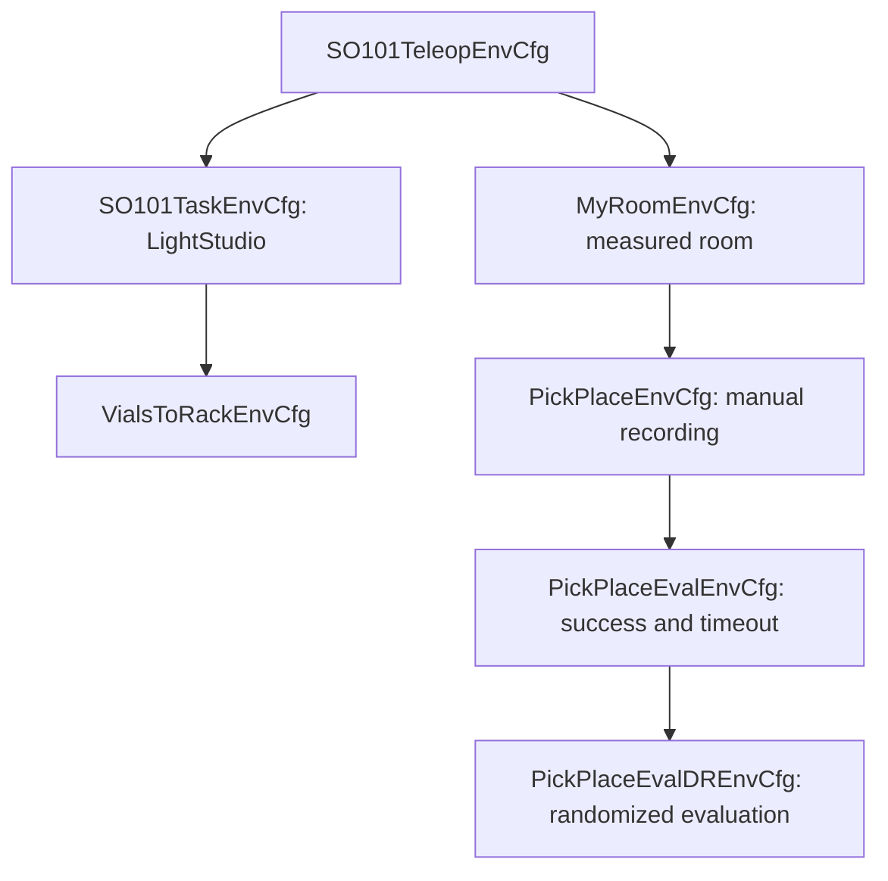

# 03 — Define a task

[Guide hub](../README.md) · Previous: [Digital twin](02-digital-twin.md) · Next: [Recording](04-recording.md)

## Configuration layers



| Source | Responsibility |
| --- | --- |
| [so101_env_cfg.py](../source/sim_to_real_so101/tasks/so101_env_cfg.py) | Robot, end-effector frame, six joint-position actions, policy observations and robot reset/material events; no teleop terminations |
| [task_env_cfg.py](../source/sim_to_real_so101/tasks/task_env_cfg.py) | Original lightbox, mat, two cameras, visual observations and DR helpers |
| [my_room_env_cfg.py](../source/sim_to_real_so101/tasks/my_room_env_cfg.py) | Alternative room, calibrated external/depth/wrist sensors, measured robot pose, materials and viewer |
| [pick_place_env_cfg.py](../source/sim_to_real_so101/tasks/pick_place_env_cfg.py) | Cube, box, jaw contact sensor, reset/tracking, subtask observations and Eval variants |

## Pick-and-place worked example

`PickPlaceSceneCfg(MyRoomSceneCfg)` adds `blue_cube` as a `RigidObjectCfg` with a
`CuboidCfg` spawn, rigid body, collision, mass and preview material. `white_box`
loads `White-Box-Physics.usda`; its placement is computed from the measured table
frame and configured clearances. `contact_grasp` is a `ContactSensorCfg` on
`{ENV_REGEX_NS}/Robot/jaw`, filtered to `{ENV_REGEX_NS}/CUBE`. The environment
activates robot contact sensors. Read your own object's geometry and physics;
`CUBE_SIZE`, `CUBE_MASS`, `WHITE_BOX_*` and `_TABLE_*` belong to the packaged setup.

`PickPlaceEventsCfg` adds `spawn_cube` using `reset_object_pose` and
`reset_tracking` using `reset_pick_place_state`. The reset places the object near
the gripper using geometry and the measured table support plane. Tracking clears
per-environment grasp/placement history. In Eval, the inherited `spawn_cube` slot
is replaced by `reset_cube_from_recorded_starts`, preserving insertion order:
robot reset → cube placement → tracking reset. `check_pick_place_eval_event_order`
validates the live manager ordering at startup. The manual `pick_place_agent`
disables automatic cube spawning, hides it, and owns spawn/countdown/save itself.

Observations are dictionaries: `policy` contains joint/relative joint/end-effector
state; `visual` contains RGB/depth/segmentation; `subtask_terms` adds
`cube_grasped` and `cube_placed`. The latter are **not written into the dataset
schema**. Rewards and terminations remain absent for manual teleop. Recording
rejects automatic terminations and requires one environment.

### What success means

The implementations are in [mdp/terms.py](../source/sim_to_real_so101/mdp/terms.py).
`object_grasped` acquires a grasp with jaw force over `force_threshold` and lift
over `min_lift` relative to the lowest observed object Z since reset. Existing
contact after acquisition still counts as holding; weaker contact is not release.
`warmup_steps` suppresses reported success just after reset.

`object_placed_in_container` requires an earlier grasp, no current holding,
placement after warmup, and the oriented cube inside the **live box frame**.
Its projected extents must fit inside `container_inner_half_size` and below the
rim from `container_size`; its centre must be at or above `container_floor_z`.
It is not latched and does not measure velocity. The termination wrapper requires
placement for `confirm_steps` consecutive control steps.

Current PickPlace settings are `min_lift=0.01`, `force_threshold=2`,
`warmup_steps=30`, `confirm_steps=25`, with metres/newtons where applicable.
These are code parameters for this task, not measurements to assume for your
hardware. Container dimensions/floor/inner walls must be measured from your USD.
`PickPlaceEvalEnvCfg` adds success and timeout; its horizon is 450 control steps
(currently 15 simulated seconds at 30 Hz). The DR class randomizes cameras,
robot/cube colour and applicable room lighting; see [Evaluation](06-evaluation.md).

## Registered environments

All IDs are exact strings from [tasks/__init__.py](../source/sim_to_real_so101/tasks/__init__.py).
There are no version suffixes on these registrations.

| Gym ID | Config |
| --- | --- |
| `Lerobot-So101-Teleop-Base` | `SO101TeleopEnvCfg` |
| `Lerobot-So101-Teleop-Task` | `SO101TaskEnvCfg` |
| `Lerobot-So101-Teleop-MyRoom` | `MyRoomEnvCfg` |
| `Lerobot-So101-Teleop-Vials-To-Rack` | `VialsToRackEnvCfg` |
| `Lerobot-So101-Teleop-Vials-To-Rack-DR` | `VialsToRackDREnvCfg` |
| `Lerobot-So101-Teleop-Vials-To-Rack-Eval` | `VialsToRackEvalEnvCfg` |
| `Lerobot-So101-Teleop-Vials-To-Rack-DR-Eval` | `VialsToRackEvalDREnvCfg` |
| `Lerobot-So101-Teleop-Pick-Place` | `PickPlaceEnvCfg` |
| `Lerobot-So101-Teleop-Pick-Place-Eval` | `PickPlaceEvalEnvCfg` |
| `Lerobot-So101-Teleop-Pick-Place-DR-Eval` | `PickPlaceEvalDREnvCfg` |

## Template for a new task

This is a **design skeleton to implement**, not another task already available
from a command. Follow the actual PickPlace classes instead of copying dimensions:

| New component | Existing pattern to copy and adapt |
| --- | --- |
| Scene subclass | `MyRoomSceneCfg` for your room, or `SO101TaskSceneCfg` for LightStudio; add a `RigidObjectCfg` and a contact sensor if success needs contact |
| Events subclass | `MyRoomEventsCfg`; add reset placement and tracking; preserve reset ordering |
| Observations subclass | `MyRoomObservationsCfg`; extend `policy`, `visual` and optional subtask group |
| Task subclass | `MyRoomEnvCfg`; wire scene/events/observations; leave teleop without terminations |
| Success function | Add your implementation in `mdp/`, expose it through `mdp/__init__.py`; define units, frame, reset state and Boolean batch output |
| Eval subclass | Add `TerminationTermCfg` for timeout and your success function |
| DR-Eval subclass | Add only events targeting assets that exist in your scene |
| Gym registration | In `tasks/__init__.py`, copy the existing `gym.register` structure: `isaaclab.envs:ManagerBasedRLEnv`, `disable_env_checker=True`, and `env_cfg_entry_point` pointing to the new config |

Choose a new task stem following the existing `Lerobot-So101-Teleop-` prefix and
`-Eval` / `-DR-Eval` suffix convention. Those names will not exist until you add
and import the registrations. No such new IDs are added by this documentation.

Camera scene entities must use `camera_` names; the recorder strips that prefix
and expects matching `rgb_` visual terms. The policy's `rename_map` maps those
short names to checkpoint keys. For MyRoom the mapping is
`{"realsense_rgb":"front","wrist_cam":"wrist"}`. Dataset preparation also fixes
`meta/modality.json` so the recorded `observation.images.*` keys match GR00T.

The existing pick-place recorder is not generic: it refers to `blue_cube`, the
robot `base`, two named GUI cameras and cube sidecars. Generic `lerobot_agent`
records other scenes but does not write those trajectories. New tasks need their
own episode-start metadata contract or a deliberate adaptation of
[episode_metadata.py](../source/sim_to_real_so101/utils/episode_metadata.py).
Likewise `lerobot_eval` enables recorded starts/colour instructions only for the
two existing PickPlace Eval IDs; adding a Gym registration alone does not extend
that branch. The host runner also selects fixed PickPlace IDs.

## Validate before collection

**Teleop container**, inspect current registrations and the worked example:

```bash
list_envs
zero_agent --task Lerobot-So101-Teleop-Pick-Place --num_steps 300
```

`zero_agent` commands zero actions, so it does not merely hold the initial joint
pose. `random_agent` samples actions continuously; inspect collision safety
before using it even in simulation. Both default to MyRoom and accept `--task`,
`--num_envs`, `--disable_fabric` plus Isaac launcher flags; only `zero_agent` has
`--num_steps` (default unlimited). Both enable cameras internally.

For your task, verify that a cube still on the table is not a grasp, a released
object outside the box is not placement, contact blocks release, and brief rim
crossings do not satisfy confirmation. Test success and timeout separately,
including same-step success/timeout. Check reset clearing across consecutive
episodes. Use the [GPU validation checklist](../docker/eval_pick_place_validation.md)
for the existing task; code-level checks do not replace observing the renderer.
